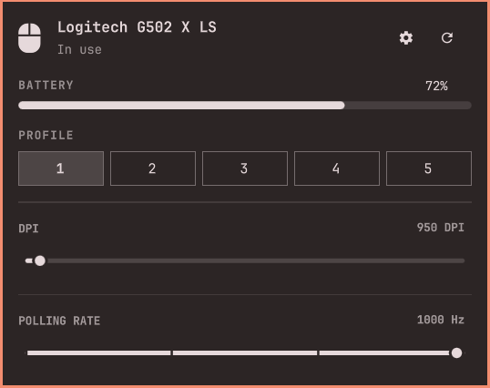

# Ratbag Mouse

An Omarchy Quattro bar plugin for gaming mice supported by libratbag.



## Features

- Automatic device detection through `ratbagd`
- Active onboard profile selection
- DPI selection
- Polling-rate selection
- Battery percentage and charging state from the Linux power-supply API
- Optional Piper launcher for advanced button and macro configuration

## Requirements

- Omarchy 4 with the Quattro shell
- `libratbag` and a running `ratbagd` system service
- A mouse supported by libratbag
- Linux HID++ battery support for battery information

Piper is optional. When installed, the gear button opens it with the system
Python interpreter so distribution-provided GTK bindings remain available.

The plugin executes `ratbagctl` with `/usr/bin` before `/usr/local/bin` in
`PATH`. This allows locally installed libratbag builds to work while keeping
the system Python interpreter and its `evdev` package available.

## Install

Install libratbag if it is not already available:

```sh
omarchy pkg add libratbag
```

Install and enable the plugin:

```sh
omarchy plugin add https://github.com/UrielCuriel/omarchy-ratbag.git --enable
```

Piper is optional and enables advanced button and macro configuration through
the gear button:

```sh
omarchy pkg add piper
```

## Usage

Click the mouse widget in the bar to open the panel. Middle-click the widget
to refresh device and battery information.

The panel writes changes directly to the mouse's onboard profile through
ratbagd.

## Permissions and processes

The plugin runs without elevated privileges. It executes `ratbagctl` to read
and write onboard mouse settings, reads battery status from
`/sys/class/power_supply`, and optionally starts Piper. Plugins run unsandboxed
inside the long-running Omarchy shell process, so review `ratbag-status` before
installation.

## Remove

```sh
omarchy plugin remove urielcuriel.ratbag --yes
```

Removing the plugin does not uninstall libratbag or Piper and does not revert
settings already stored in the mouse.

## Validate

```sh
omarchy plugin validate "$HOME/.config/omarchy/plugins/urielcuriel.ratbag"
qmllint -I "$OMARCHY_PATH/shell" \
  "$HOME/.config/omarchy/plugins/urielcuriel.ratbag/BarWidget.qml" \
  "$HOME/.config/omarchy/plugins/urielcuriel.ratbag/Panel.qml"
```
